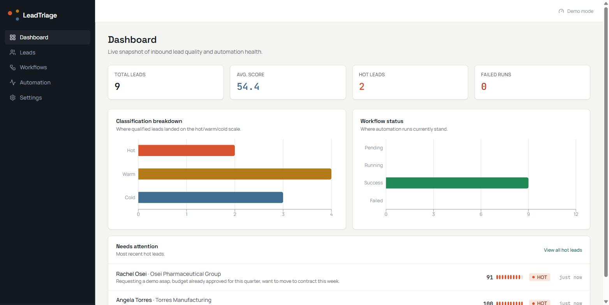
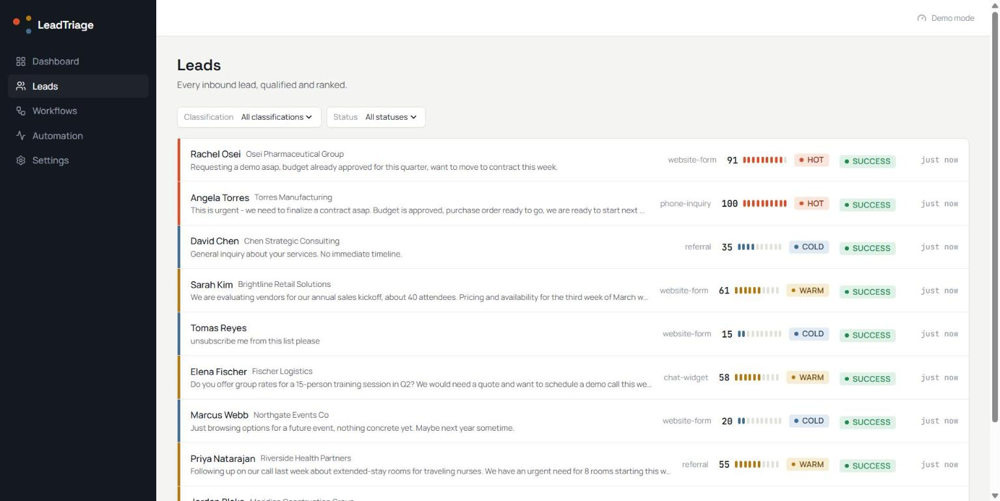
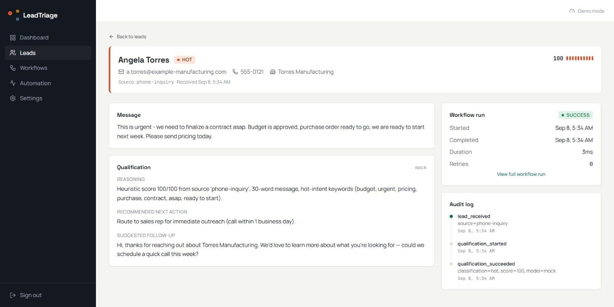
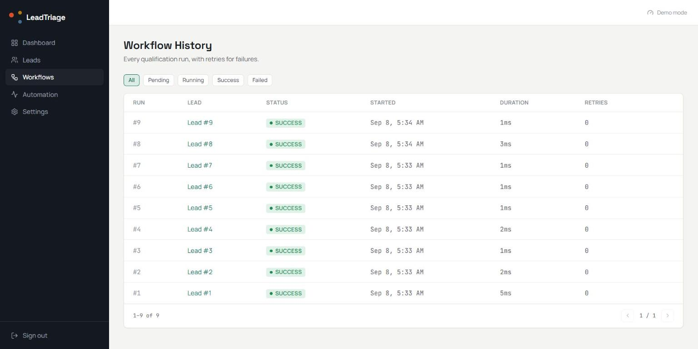
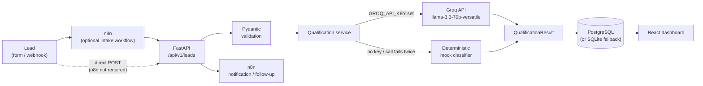

# LeadTriage

AI-powered lead qualification and follow-up automation — a webhook intake pipeline that scores and classifies inbound leads with an LLM, tracks every automation run to completion or failure, and surfaces it all in an operator dashboard.

This is an example of a business AI automation system I can build for a client: replace a manual "someone reads every form submission and decides what matters" process with a pipeline that classifies, scores, and drafts a first response automatically, while keeping a full audit trail of what happened and why.

## Screenshots


*Live snapshot of inbound lead quality — classification breakdown, workflow status, and the leads needing attention first.*


*Every qualified lead ranked by score, with classification and workflow status visible at a glance.*


*The core workflow: a lead's full qualification result — reasoning, recommended action, suggested follow-up — plus its workflow run and audit log.*


*Every qualification run tracked to completion, with retry counts for failures.*

## Problem

A lead comes in through a form, a webhook, or a chat widget. Someone has to read it, decide if it's worth a same-day callback or a nurture-sequence email, and draft a response — and that triage step is the first thing that slips when volume goes up or the person doing it is on vacation. There's also usually no record of *why* a lead got prioritized the way it did, which makes it hard to improve the process later.

## Solution

LeadTriage turns lead intake into a repeatable pipeline: a webhook (optionally via n8n) posts the lead to a FastAPI backend, which validates it, sends it to an LLM for classification and scoring, stores a structured result, and logs every step of the run — including failures, so a bad LLM response or a downstream error doesn't just vanish. The dashboard shows operators what came in, what the system decided, and what to do next; a failed run can be retried with one click.

## Features

- **Webhook lead intake** — `POST /api/v1/leads` accepts a lead and runs it through qualification synchronously, returning the classification, score, and reasoning immediately.
- **AI lead qualification** — an LLM call (Groq, `llama-3.3-70b-versatile`) returns structured JSON: classification (`hot`/`warm`/`cold`), a 0-100 score, a reasoning summary, a recommended next action, and a suggested follow-up message.
- **Deterministic mock fallback** — with no `GROQ_API_KEY` set, or if the real call fails twice, a genuine heuristic classifier takes over (keyword-weighted scoring against hot/warm/cold signal words, adjusted for message length, company name, and source) — the app is fully demoable with zero paid services, not just a "coming soon" placeholder.
- **Workflow history & retries** — every qualification attempt is a tracked `WorkflowRun` (`pending`/`running`/`success`/`failed`); a failed run can be retried via `POST /api/v1/workflows/{id}/retry`, which correctly rejects retrying a run that isn't in a failed state (409).
- **Audit logging** — every meaningful event (lead received, qualification started/succeeded/failed, retry triggered) is recorded as a timestamped `AuditLogEntry` tied to its workflow run.
- **Analytics summary** — total leads, breakdown by classification and status, average score, via `GET /api/v1/analytics/summary`.
- **n8n orchestration (optional)** — three importable n8n workflows (lead intake, notification, follow-up) sit in front of the same API. The API works standalone without n8n running at all; n8n is an orchestration layer, not a hard dependency.
- **JWT auth** — single-operator login (`POST /api/v1/auth/login`), bearer token required on every endpoint except `/health` and login.

## Architecture



Request flow: a lead arrives at `/api/v1/leads` (directly, or via an n8n webhook), gets validated, is sent to the qualification service, which calls Groq for a real classification or falls back to the mock heuristic, persists the result plus a `WorkflowRun` and `AuditLogEntry` records, and returns the full result inline. The React dashboard reads everything back through the same API. Notifications and follow-ups are handled by two more optional n8n workflows that FastAPI can call after qualification completes.

## Technology Stack

**Backend**
- Python, FastAPI, Pydantic v2 (request/response validation)
- SQLAlchemy + Alembic (migrations) — PostgreSQL in production, SQLite fallback for local dev/CI
- JWT auth (bcrypt password hashing)
- Groq SDK (`llama-3.3-70b-versatile`) for LLM qualification, with a real (non-trivial) heuristic fallback classifier
- Structured logging

**Frontend**
- React 19 + TypeScript + Vite
- Tailwind CSS — a deliberate "triage signal" visual design (dark sidebar, warm-neutral content area, a consistent hot/warm/cold color language across badges, charts, and score meters), not a default admin-template look
- recharts for the dashboard's classification/status breakdowns
- axios with a JWT interceptor and 401 auto-logout

**Automation**
- n8n workflow definitions (`n8n-workflows/`) — lead intake, notification, follow-up — plain webhook-in/webhook-out, no paid n8n nodes required

**Infra**
- Docker Compose (API + PostgreSQL) — verified working end-to-end, including running Alembic migrations against the containerized database
- GitHub Actions CI for both backend (ruff + pytest) and frontend (lint + typecheck + test + build)

## API

Full interactive docs at `/docs` once the backend is running (FastAPI's built-in Swagger UI). Endpoint summary:

| Method | Path | Purpose |
|---|---|---|
| GET | `/health` | Liveness check, no auth |
| POST | `/api/v1/auth/login` | Get a bearer token |
| POST | `/api/v1/leads` | Create a lead, run qualification, return the full result |
| GET | `/api/v1/leads` | Paginated list, filterable by classification/status |
| GET | `/api/v1/leads/{id}` | Lead + qualification result + workflow run + audit log |
| GET | `/api/v1/workflows` | Paginated workflow run list, filterable by status |
| GET | `/api/v1/workflows/{id}` | Workflow run detail + audit log |
| POST | `/api/v1/workflows/{id}/retry` | Re-run qualification for a failed lead (409 if not failed) |
| GET | `/api/v1/analytics/summary` | Totals, breakdowns, average score |

## Environment Variables

Copy `backend/.env.example` to `backend/.env` and fill in real values — **never commit `.env`**.

| Variable | Purpose |
|---|---|
| `DATABASE_URL` | PostgreSQL connection string; leave unset to use local SQLite |
| `SECRET_KEY` | JWT signing secret |
| `ADMIN_USERNAME` / `ADMIN_PASSWORD_HASH` | Single-operator login (bcrypt hash, not plaintext) |
| `GROQ_API_KEY` | Free tier key from [console.groq.com](https://console.groq.com) — leave unset to run entirely on the mock classifier |
| `NOTIFICATION_WEBHOOK_URL` | Slack-compatible webhook for new-lead/follow-up alerts — leave unset to log-only |

Frontend: copy `frontend/.env.example` and set `VITE_API_BASE_URL` to the backend's URL.

## Local Development

**Backend**
```bash
cd backend
python -m venv .venv && source .venv/Scripts/activate  # or .venv/bin/activate
pip install -r requirements.txt
cp .env.example .env   # fill in values; leave GROQ_API_KEY unset to use the mock classifier
alembic upgrade head
uvicorn main:app --reload
```

**Frontend**
```bash
cd frontend
npm install
npm run dev
```

**Or, the whole stack with Docker:**
```bash
docker compose up
```
This runs the API against a real containerized PostgreSQL, running migrations automatically.

## Testing

- **Backend**: 27 pytest tests — the mock classifier's heuristic logic, the full auth flow, lead creation through qualification (mock provider path, since CI has no live Groq key), the retry endpoint's success and 409-conflict cases, and validation-failure handling.
- **Frontend**: 18 Vitest/React Testing Library tests — score/classification/status display logic, retry-eligibility rules, date/duration formatting, and component-level rendering against mocked API data.

Run backend tests: `cd backend && pytest`. Run frontend tests: `cd frontend && npm test`.

## n8n Workflows

Three importable workflow definitions live in `n8n-workflows/` — see that folder's own README for import instructions and required environment variables. The API works standalone without n8n; these exist to demonstrate the no-code orchestration layer a client would actually use in front of it.

## Deployment

Designed to run anywhere Docker runs: `docker compose up` starts the API and PostgreSQL together, with Alembic migrations applied automatically on startup. No deployment-specific configuration is committed (this is a portfolio/demo build, not a project with a live production target).

## Engineering Challenges

- **Making the "no paid services" constraint real, not aspirational.** The mock classifier isn't a stub that always returns the same value — it's a genuine weighted heuristic (keyword matching against hot/warm/cold signal words, adjusted for message length, company presence, and lead source) that produces varied, defensible-looking output, so a demo without a Groq key still looks and behaves like a real qualification system.
- **Keeping n8n genuinely optional.** The three n8n workflows front the same `/api/v1/leads` endpoint rather than owning any logic themselves — the backend has to work identically whether n8n is running or not, which shaped the API to be a real REST contract rather than something n8n-shaped.
- **Structured LLM output that doesn't silently break.** The Groq prompt demands strict JSON; a malformed response gets one corrective retry before falling back to the mock classifier, so a flaky LLM response degrades gracefully instead of surfacing a 500 to the operator.

## Future Improvements

- Async/background qualification (current design runs qualification synchronously inside the request, which is fine at demo scale but wouldn't hold up under real webhook burst traffic).
- Rate limiting on the public-facing intake endpoint.
- Multi-tenant auth (currently single-operator by design, matching the project's scope).

## Freelance Relevance

This project demonstrates the core shape of AI automation work clients actually pay for: taking an existing manual triage/qualification process and replacing it with a webhook-driven pipeline that's observable (every run is tracked, failures are visible and retryable, not silent), degrades gracefully when an external API has a bad day, and is fronted by a no-code orchestration layer (n8n) so non-engineers on the client's team can see and adjust the automation without touching code.
